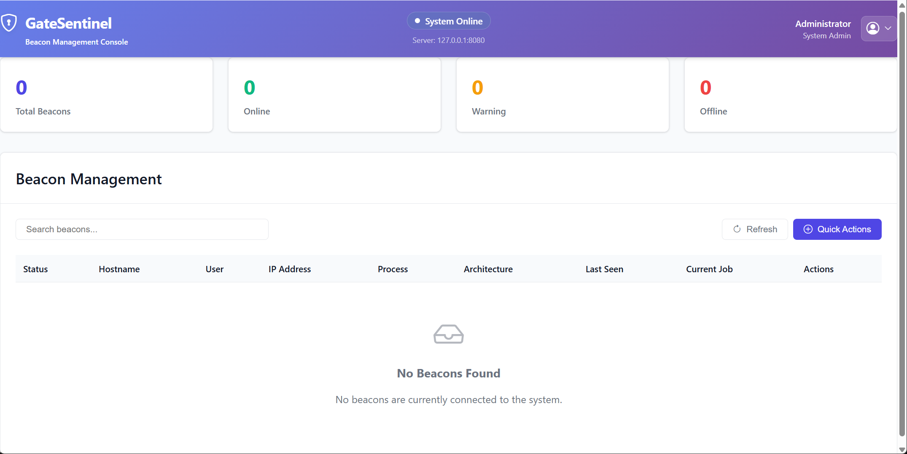
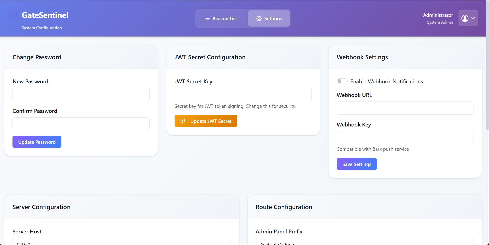
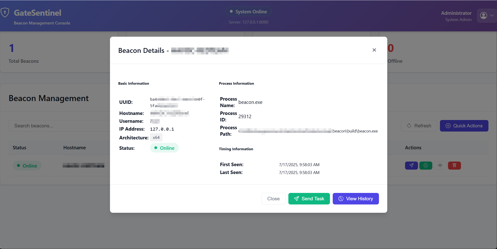
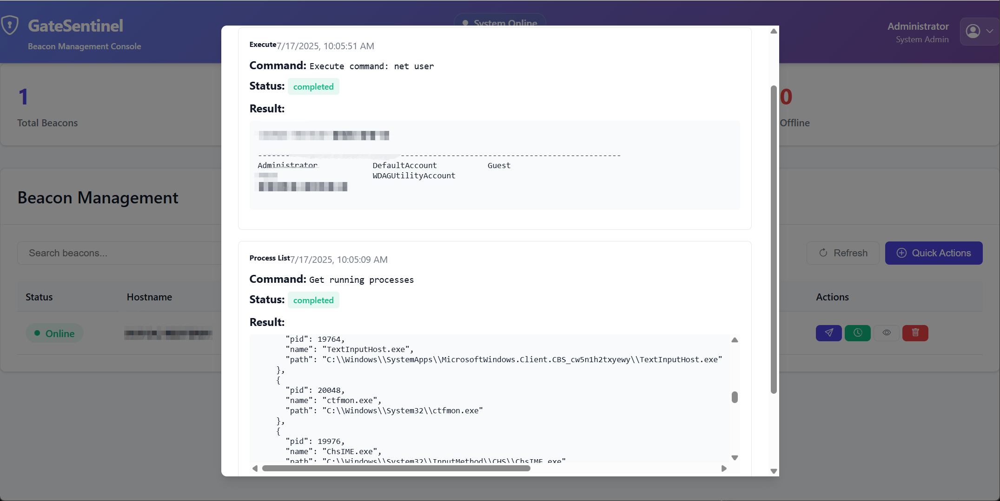

# GateSentinel

[English](#english) | [中文](#中文)

---

## 中文

### 🛡️ 项目简介

GateSentinel 是一个现代化的 C2 (Command and Control) 框架，专为安全研究和渗透测试设计。该项目采用 Go 语言开发服务端，C 语言开发客户端，提供了强大的远程控制和管理功能。

> **⚠️ 重要声明**
>
> 这是一个**初创的概念项目**，目前处于早期开发阶段。后期架构可能会有**重大改动**，请做好相应准备。
>
> 项目中的很多代码由 **AI 辅助完成**，虽然经过测试，但可能存在未发现的问题。如果您在使用过程中遇到任何问题，**请务必及时反馈**，这将帮助我们持续改进项目质量。
>
> 对于非严重性 bug 和功能更新，我们将在 **知识星球** 进行持续更新和技术交流。

### ✨ 核心特性

- **🔐 流量伪装**: 支持可配置的前缀/后缀包装，将 C2 流量伪装成普通 Web 内容
- **🌐 双协议支持**: 同时支持 HTTP 和 HTTPS 协议，可灵活切换
- **🔒 自定义编码**: 使用混淆的 Base64 编码表增强数据传输安全性
- **⚡ 热重载配置**: 支持配置文件热重载，无需重启服务
- **🎯 隐蔽端点**: 可自定义 API 端点路径，隐藏真实的通信接口
- **📊 Web 管理界面**: 提供直观的 Web 界面进行 Beacon 管理
- **🔧 灵活部署**: 支持 EXE 和 DLL 两种客户端部署模式

### 🚀 技术特色

#### 下一代 C2 体验
- **🎯 PIC Beacon**: 位置无关代码，更好的内存执行能力
- **🔧 BOF 支持**: 兼容 Beacon Object Files，扩展功能模块化
- **💻 .NET 内存加载**: 直接在内存中执行 .NET 程序集
- **🎨 CS 风格交互**: 类似 Cobalt Strike 的命令行和图形界面体验

#### 现代化架构设计
- **🏗️ 模块化设计**: 核心功能模块化，便于扩展和维护
- **🔄 异步通信**: 高性能异步 I/O，支持大量并发连接
- **📦 容器化部署**: 支持 Docker 容器化部署
- **🌐 云原生**: 适配云环境和分布式部署

### 📸 项目截图

#### 管理界面展示
<div align="center">

**主控制台界面**


**Beacon 管理界面**


**任务执行界面**




</div>

### 🏗️ 系统架构

```
┌─────────────────┐    HTTPS/HTTP    ┌─────────────────┐
│   Beacon Client │ ◄──────────────► │  GateSentinel   │
│   (C/C++)       │   Traffic        │   Server (Go)   │
│                 │   Disguise       │                 │
└─────────────────┘                  └─────────────────┘
                                              │
                                              ▼
                                     ┌─────────────────┐
                                     │   Web Admin     │
                                     │   Interface     │
                                     └─────────────────┘
```

### 🚀 快速开始

#### 服务端部署

1. **编译服务端**
   ```bash
   cd server
   go build -o gatesentinel.exe
   ```

2. **配置服务**
   ```bash
   # 编辑配置文件
   vim config.json
   
   # 启动服务
   ./gatesentinel.exe
   ```

3. **访问管理界面**
   ```
   HTTP:  http://localhost:8080/websafe/admin
   HTTPS: https://localhost:8443/websafe/admin
   默认账号: admin / admin123
   ```

#### 客户端部署

1. **编译客户端**
   ```bash
   cd beacon
   gcc -o beacon.exe beacon.c http.c tasks.c utils.c -lwininet -ladvapi32 -lkernel32 -luser32 -DUNICODE -D_UNICODE
   ```

2. **配置客户端**
   ```c
   // 编辑 beacon/config.h
   #define SERVER_HOST L"your-server-ip"
   #define USE_HTTPS 1  // 0=HTTP, 1=HTTPS
   ```

3. **运行客户端**
   ```bash
   ./beacon.exe
   ```

### ⚙️ 配置规范

#### 服务端配置 (server/config.json)

```json
{
  "server": {
    "host": "0.0.0.0",
    "port": 8080,
    "enable_https": true,
    "https_port": 8443,
    "cert_file": "./certs/server.crt",
    "key_file": "./certs/server.key"
  },
  "routes": {
    "beacon_endpoint": "/api.jsp",
    "register_path": "/sync_debug",
    "admin_prefix": "/websafe/admin"
  },
  "encoding": {
    "use_custom_base64": true,
    "custom_base64_table": "QWERTYUIOPASDFGHJKLZXCVBNMqwertyuiopasdfghjklzxcvbnm0123456789+/"
  },
  "traffic_disguise": {
    "enable": true,
    "prefix": "<!--",
    "suffix": "-->"
  }
}
```

#### 客户端配置 (beacon/config.h)

```c
// 服务器配置
#define SERVER_HOST L"127.0.0.1"
#define SERVER_PORT 8080
#define USE_HTTPS 1
#define HTTPS_PORT 8443

// 通信配置
#define INITIAL_SLEEP_TIME 10
#define CLIENT_TOKEN L"Demo"

// 端点配置
#define API_ENDPOINT L"/api.jsp"
#define REGISTER_ENDPOINT L"/sync_debug"

// 流量伪装配置
#define ENABLE_TRAFFIC_DISGUISE 1
#define TRAFFIC_PREFIX "<!--"
#define TRAFFIC_SUFFIX "-->"
```

### 🔧 协议切换工具

使用内置工具快速切换 HTTP/HTTPS 模式：

```bash
# 切换到 HTTP 模式
go run switch_protocol.go http

# 切换到 HTTPS 模式
go run switch_protocol.go https
```

### 🔐 SSL 证书配置

#### 生成自签名证书

```bash
# 创建证书目录
mkdir -p server/certs

# 生成私钥
openssl genrsa -out server/certs/server.key 2048

# 生成证书
openssl req -new -x509 -key server/certs/server.key -out server/certs/server.crt -days 365 -subj "/CN=localhost"
```

#### 使用自动证书生成

```bash
# 运行内置证书生成工具
go run test_https_support.go
```

### 📋 当前功能

- ✅ **基础通信**: HTTP/HTTPS 双协议支持
- ✅ **流量伪装**: HTML 注释格式伪装
- ✅ **进程管理**: 进程列表获取和管理
- ✅ **命令执行**: 远程命令执行功能
- ✅ **配置管理**: 热重载配置系统
- ✅ **Web 界面**: 管理员控制面板

### 🚧 开发路线图

#### 即将实现的功能

- 🔄 **Webhook 集成**
  - 支持多种 Webhook 通知 (Slack, Discord, 钉钉, 企业微信)
  - 自定义事件触发器 (上线/下线, 任务完成, 错误告警)
  - 集成主流通知平台和自定义 HTTP 回调
  - 实时状态推送和告警机制

- 💾 **文件管理系统**
  - 文件上传/下载功能 (支持大文件分块传输)
  - 目录浏览和操作 (创建、删除、重命名)
  - 文件搜索和过滤 (按类型、大小、时间)
  - 文件完整性校验 (MD5/SHA256)

- 🎯 **高级载荷技术**
  - **BOF (Beacon Object Files)** 支持
  - **内存加载 .NET** 程序集执行
  - **PIC (Position Independent Code) Beacon** 实现
  - Shellcode 注入和进程空心化技术
  - 反射 DLL 加载 (无文件落地执行)
  - 多种注入技术 (SetWindowsHookEx, Manual DLL Mapping)

- 🎨 **用户体验优化**
  - **类似 Cobalt Strike 的交互式体验**
  - **舒适的生成体验** (一键生成各种载荷)
  - **舒适的监听器创建** (图形化配置界面)
  - 现代化的 Web 管理界面
  - 实时日志和状态监控
  - 批量操作和任务调度

- 📸 **屏幕截图与监控**
  - 实时屏幕捕获 (定时截图, 按需截图)
  - 多显示器支持 (指定显示器截图)
  - 图像压缩传输 (JPEG 压缩, 质量可调)
  - 截图历史管理 (本地存储, 远程查看)

- 🔐 **高级持久化**
  - 服务安装功能 (Windows 服务注册)
  - 注册表持久化 (启动项, 服务配置)
  - 计划任务集成 (定时执行, 触发器)
  - WMI 事件订阅 (系统事件响应)

- 📊 **增强监控**
  - 键盘记录功能 (按键记录, 窗口标题)
  - 网络流量监控 (连接状态, 流量统计)
  - 系统信息收集 (硬件信息, 软件列表, 网络配置)
  - 实时性能监控 (CPU, 内存, 磁盘使用率)

- 🛡️ **反检测技术**
  - 进程名伪装 (随机进程名, 合法进程模拟)
  - API Hook 检测 (反调试, 反沙箱)
  - 沙箱环境识别 (虚拟机检测, 分析环境识别)
  - 流量混淆增强 (多种伪装模式, 动态特征变化)
  - 内存规避技术 (堆喷射, ROP 链构造)

### 🔒 安全特性

- **流量混淆**: 数据传输采用 HTML 注释格式伪装
- **加密通信**: 支持 TLS/SSL 加密传输
- **自定义编码**: 使用混淆的 Base64 编码表
- **证书忽略**: 客户端支持忽略 SSL 证书错误
- **隐蔽端点**: 可自定义 API 路径隐藏真实接口

### 📖 详细部署指南

#### 环境要求

**服务端**
- Go 1.19+
- 操作系统: Windows/Linux/macOS
- 内存: 最小 512MB，推荐 1GB+
- 磁盘: 最小 100MB 可用空间

**客户端**
- Windows 7/8/10/11 (x86/x64)
- Visual Studio Build Tools 或 MinGW-w64
- 网络连接 (HTTP/HTTPS)

#### 生产环境部署

**1. 服务端生产配置**

```json
{
  "server": {
    "host": "0.0.0.0",
    "port": 80,
    "enable_https": true,
    "https_port": 443,
    "cert_file": "/etc/ssl/certs/your-domain.crt",
    "key_file": "/etc/ssl/private/your-domain.key",
    "read_timeout": 30,
    "write_timeout": 30,
    "max_body_size": 50
  },
  "routes": {
    "beacon_endpoint": "/api/v1/status",
    "register_path": "/api/v1/register",
    "admin_prefix": "/admin/dashboard"
  },
  "webhook_enable": true,
  "webhook_url": "https://hooks.slack.com/services/YOUR/SLACK/WEBHOOK"
}
```

**2. 反向代理配置 (Nginx)**

```nginx
server {
    listen 80;
    listen 443 ssl;
    server_name your-domain.com;

    ssl_certificate /etc/ssl/certs/your-domain.crt;
    ssl_certificate_key /etc/ssl/private/your-domain.key;

    location / {
        proxy_pass http://127.0.0.1:8080;
        proxy_set_header Host $host;
        proxy_set_header X-Real-IP $remote_addr;
        proxy_set_header X-Forwarded-For $proxy_add_x_forwarded_for;
        proxy_set_header X-Forwarded-Proto $scheme;
    }
}
```

**3. 系统服务配置 (systemd)**

```ini
[Unit]
Description=GateSentinel C2 Server
After=network.target

[Service]
Type=simple
User=gatesentinel
WorkingDirectory=/opt/gatesentinel
ExecStart=/opt/gatesentinel/gatesentinel
Restart=always
RestartSec=5

[Install]
WantedBy=multi-user.target
```

### 🔍 故障排除

#### 常见问题

**1. 客户端无法连接服务器**
```bash
# 检查网络连通性
ping your-server-ip
telnet your-server-ip 8080

# 检查防火墙设置
netsh advfirewall firewall show rule name="GateSentinel"
```

**2. HTTPS 证书错误**
```bash
# 验证证书有效性
openssl x509 -in server/certs/server.crt -text -noout

# 检查证书链
openssl verify -CAfile ca.crt server/certs/server.crt
```

**3. 编译错误**
```bash
# 更新 Go 模块
go mod tidy
go mod download

# 清理构建缓存
go clean -cache
```

### 📝 使用说明

1. **安全使用**: 本项目仅用于授权的安全测试和研究
2. **合法合规**: 使用前请确保符合当地法律法规
3. **责任声明**: 用户需对使用本工具的行为负责
4. **数据保护**: 注意保护收集的敏感信息，遵循数据保护法规

### 📁 项目结构

```
GateSentinel/
├── server/                 # Go 服务端
│   ├── config/            # 配置管理
│   ├── handler/           # HTTP 处理器
│   ├── models/            # 数据模型
│   ├── static/            # 静态资源
│   ├── templates/         # HTML 模板
│   ├── certs/             # SSL 证书
│   ├── config.json        # 服务端配置
│   └── main.go            # 主程序入口
├── beacon/                # C 客户端
│   ├── beacon.c           # 主程序
│   ├── http.c             # HTTP 通信
│   ├── tasks.c            # 任务处理
│   ├── utils.c            # 工具函数
│   └── config.h           # 客户端配置
├── docs/                  # 文档目录
├── scripts/               # 辅助脚本
├── README.md              # 项目说明
└── LICENSE                # 许可证文件
```

### 🤝 贡献指南

欢迎各种形式的贡献！

#### 问题反馈
1. **严重 Bug**: 请通过 GitHub Issues 立即报告
2. **功能建议**: 通过 GitHub Issues 提出功能请求
3. **一般问题**: 可在知识星球进行讨论和交流

#### 代码贡献
1. **代码贡献**: Fork 项目并提交 Pull Request
2. **文档改进**: 帮助完善文档和示例
3. **测试反馈**: 在不同环境下测试并反馈问题

#### 开发规范
- 遵循现有代码风格
- 添加适当的注释和文档
- 确保新功能有相应的测试
- 提交前运行所有测试

#### 社区交流
- **知识星球**: 日常技术交流、非严重 bug 讨论、功能更新通知
- **GitHub Issues**: 严重问题报告、功能请求
- **Pull Requests**: 代码贡献和改进

> **注意**: 由于项目中大量使用 AI 辅助开发，我们特别重视社区反馈。您的每一个问题报告都将帮助我们改进代码质量和用户体验。

### 📄 许可证

本项目采用 MIT 许可证 - 查看 [LICENSE](LICENSE) 文件了解详情。

### 🌟 社区与支持

#### 知识星球
我们建立了专门的知识星球社区，提供：
- 📚 **技术文档**: 详细的使用教程和最佳实践
- 🔄 **功能更新**: 最新功能发布和更新通知
- 🐛 **问题讨论**: 非严重 bug 讨论和解决方案
- 💡 **经验分享**: 社区成员的使用经验和技巧分享
- 🤝 **技术交流**: 与开发者和其他用户的直接交流

> 加入知识星球，获取第一手的技术资料和社区支持！

#### GitHub 社区
- **Issues**: 严重问题报告和功能请求
- **Discussions**: 开放式技术讨论
- **Pull Requests**: 代码贡献和改进建议

### ⭐ Star History

如果这个项目对您有帮助，请给我们一个 Star！

[](https://star-history.com/#kyxiaxiang/GateSentinel&Date)

### 📞 联系我们

- **项目问题**: GitHub Issues
- **技术交流**: 知识星球
- **商务合作**: 请通过 GitHub 联系

---

**免责声明**: 本项目仅供学习和授权测试使用，请遵守当地法律法规。使用者需对自己的行为负责。

---

## English

### 📸 Screenshots

#### Management Interface
<div align="center">

**Main Console**


**Beacon Management**


**Task Execution**


**System Monitoring**


</div>

### 🛡️ Project Overview

GateSentinel is a modern C2 (Command and Control) framework designed for security research and penetration testing. The project features a Go-based server and C-based client, providing powerful remote control and management capabilities.

> **⚠️ Important Notice**
>
> This is an **early-stage concept project** currently in active development. The architecture may undergo **significant changes** in future versions.
>
> Much of the codebase has been **AI-assisted**, and while thoroughly tested, there may be undiscovered issues. If you encounter any problems during use, **please report them immediately** to help us continuously improve the project quality.
>
> For non-critical bugs and feature updates, we will provide ongoing updates and technical discussions through our **Knowledge Planet community**.

### ✨ Key Features

- **🔐 Traffic Disguise**: Configurable prefix/suffix wrapping to disguise C2 traffic as normal web content
- **🌐 Dual Protocol Support**: Supports both HTTP and HTTPS protocols with flexible switching
- **🔒 Custom Encoding**: Enhanced data transmission security using scrambled Base64 encoding tables
- **⚡ Hot Reload Configuration**: Supports configuration hot reload without service restart
- **🎯 Stealth Endpoints**: Customizable API endpoint paths to hide real communication interfaces
- **📊 Web Management Interface**: Intuitive web interface for Beacon management
- **🔧 Flexible Deployment**: Supports both EXE and DLL client deployment modes

### 🚀 Technical Highlights

#### Next-Generation C2 Experience
- **🎯 PIC Beacon**: Position Independent Code for better in-memory execution
- **🔧 BOF Support**: Compatible with Beacon Object Files for modular functionality
- **💻 .NET Memory Loading**: Direct in-memory execution of .NET assemblies
- **🎨 CS-Style Interaction**: Cobalt Strike-like command line and GUI experience

#### Modern Architecture Design
- **🏗️ Modular Design**: Core functionality is modularized for easy extension and maintenance
- **🔄 Asynchronous Communication**: High-performance async I/O supporting massive concurrent connections
- **📦 Containerized Deployment**: Docker containerization support
- **🌐 Cloud Native**: Adapted for cloud environments and distributed deployment

### 🚀 Quick Start

#### Server Deployment

1. **Compile Server**
   ```bash
   cd server
   go build -o gatesentinel.exe
   ```

2. **Configure Service**
   ```bash
   # Edit configuration file
   vim config.json
   
   # Start service
   ./gatesentinel.exe
   ```

3. **Access Admin Interface**
   ```
   HTTP:  http://localhost:8080/websafe/admin
   HTTPS: https://localhost:8443/websafe/admin
   Default: admin / admin123
   ```

#### Client Deployment

1. **Compile Client**
   ```bash
   cd beacon
   gcc -o beacon.exe beacon.c http.c tasks.c utils.c -lwininet -ladvapi32 -lkernel32 -luser32 -DUNICODE -D_UNICODE
   ```

2. **Configure Client**
   ```c
   // Edit beacon/config.h
   #define SERVER_HOST L"your-server-ip"
   #define USE_HTTPS 1  // 0=HTTP, 1=HTTPS
   ```

### 📋 Current Features

- ✅ **Basic Communication**: HTTP/HTTPS dual protocol support
- ✅ **Traffic Disguise**: HTML comment format disguise
- ✅ **Process Management**: Process listing and management
- ✅ **Command Execution**: Remote command execution
- ✅ **Configuration Management**: Hot reload configuration system
- ✅ **Web Interface**: Administrator control panel

### 🚧 Roadmap

#### Upcoming Features

- 🔄 **Webhook Integration**
  - Multi-platform webhook notifications (Slack, Discord, Teams, DingTalk, WeChat Work)
  - Custom event triggers (online/offline, task completion, alerts)
  - Integration with mainstream platforms and custom HTTP callbacks
  - Real-time status push and alerting mechanisms

- 💾 **File Management System**
  - File upload/download with chunked transfer support
  - Directory browsing and operations (create, delete, rename)
  - File search and filtering (by type, size, date)
  - File integrity verification (MD5/SHA256)

- 🎯 **Advanced Payload Technologies**
  - **BOF (Beacon Object Files)** support
  - **In-memory .NET assembly loading** and execution
  - **PIC (Position Independent Code) Beacon** implementation
  - Shellcode injection and process hollowing techniques
  - Reflective DLL loading (fileless execution)
  - Multiple injection methods (SetWindowsHookEx, Manual DLL Mapping)

- 🎨 **User Experience Optimization**
  - **Cobalt Strike-like interactive experience**
  - **Comfortable payload generation experience** (one-click generation)
  - **Comfortable listener creation** (graphical configuration interface)
  - Modern web management interface
  - Real-time logging and status monitoring
  - Batch operations and task scheduling

- 📸 **Screenshot & Monitoring**
  - Real-time screen capture (scheduled/on-demand)
  - Multi-monitor support (specific display targeting)
  - Image compression transmission (JPEG compression, adjustable quality)
  - Screenshot history management (local storage, remote viewing)

- 🔐 **Advanced Persistence**
  - Service installation (Windows service registration)
  - Registry persistence (startup entries, service configuration)
  - Scheduled task integration (timed execution, triggers)
  - WMI event subscription (system event response)

- 📊 **Enhanced Monitoring**
  - Keylogging functionality (keystroke recording, window titles)
  - Network traffic monitoring (connection status, traffic statistics)
  - System information collection (hardware info, software list, network config)
  - Real-time performance monitoring (CPU, memory, disk usage)

- 🛡️ **Anti-Detection Techniques**
  - Process name masquerading (random names, legitimate process simulation)
  - API hook detection (anti-debugging, anti-sandbox)
  - Sandbox environment identification (VM detection, analysis environment recognition)
  - Enhanced traffic obfuscation (multiple disguise modes, dynamic signature changes)
  - Memory evasion techniques (heap spraying, ROP chain construction)

### 🔒 Security Features

- **Traffic Obfuscation**: Data transmission disguised as HTML comments
- **Encrypted Communication**: TLS/SSL encrypted transmission support
- **Custom Encoding**: Scrambled Base64 encoding tables
- **Certificate Bypass**: Client supports ignoring SSL certificate errors
- **Stealth Endpoints**: Customizable API paths to hide real interfaces

### 📝 Usage Guidelines

1. **Secure Usage**: This project is for authorized security testing and research only
2. **Legal Compliance**: Ensure compliance with local laws and regulations before use
3. **Responsibility**: Users are responsible for their actions when using this tool

### 🤝 Contributing

We welcome all forms of contributions!

#### Issue Reporting
1. **Critical Bugs**: Please report immediately via GitHub Issues
2. **Feature Requests**: Submit through GitHub Issues
3. **General Questions**: Discuss in our Knowledge Planet community

#### Code Contributions
1. **Code Contributions**: Fork the project and submit Pull Requests
2. **Documentation**: Help improve documentation and examples
3. **Testing**: Test in different environments and provide feedback

#### Development Guidelines
- Follow existing code style
- Add appropriate comments and documentation
- Ensure new features have corresponding tests
- Run all tests before submitting

#### Community
- **Knowledge Planet**: Daily technical discussions, non-critical bug discussions, feature update notifications
- **GitHub Issues**: Critical issue reports, feature requests
- **Pull Requests**: Code contributions and improvements

> **Note**: Due to extensive AI-assisted development in this project, we particularly value community feedback. Every issue report helps us improve code quality and user experience.

### 📄 License

This project is licensed under the MIT License - see the [LICENSE](LICENSE) file for details.
